createTime:2023/7/10

# kyouBlog

基于springboot,vue3,mybatis-plus,Dubbo,Minio,Redis,springSecurity,JWT的全栈个人博客系统
--1.0版本完成时间：2023/08/03，希望大家能够给个star，共同学习进步
github地址：https://github.com/theload9638/kyouBlog
gitee地址：https://gitee.com/ccploy/kyouBlog?_from=gitee_search

# 1.后端文件结构

| document         | 相关技术文档                           |
| ---------------- | -------------------------------------- |
| kyou-parent      | 项目的父模块，统一管理版本             |
| kyou-demo        | 项目的测试模块，用于测试和生成代码     |
| kyou-model       | 项目的实体类等模块                     |
| kyou-common      | 项目的公共模块，存放工具类，配置常量等 |
| kyou-front       | 项目的前端代码                         |
| kyou-dataService | 项目的数据层，服务层提供者             |
| kyou-background  | 项目的后台访问入口                     |

# 2.项目综合技术栈

| spring-boot-starter-freemarker               | 模板引擎，代码生成       |
| -------------------------------------------- | ------------------------ |
| spring-boot-starter-validation               | 校验框架                 |
| dubbo-spring-boot-starter                    | RPC远程调用              |
| dubbo-dependencies-zookeeper                 | 注册中心                 |
| minio                                        | 对象存储服务             |
| spring-boot-starter-security                 | 安全框架                 |
| velocity-engine-core，mybatis-plus-generator | mybatis-plus代码生成依赖 |
| spring-boot-starter-data-redis               | redis缓存                |
| mybatis-plus-boot-starter                    | mybatis-plus依赖         |
| mysql-connector-j                            | 数据库依赖               |
| spring-boot-configuration-processor          | yml提示                  |
| lombok                                       | Java语言增强库           |
| spring-boot-starter-aop                      | aop切面                  |
| hutool-all                                   | hutool工具包             |
| jjwt                                         | jwt令牌技术              |
| knife4j-spring-boot-starter                  | swaggerAPI文档生成工具   |

# 3.前端技术

| Vue3         | 前端框架     |
| ------------ | ------------ |
| Vue-router   | 路由框架     |
| Element-plus | 前端UI框架   |
| Axios        | 前端HTTP框架 |
| undraw-ui    | 评论插件     |
| v-md-editor  | markdown插件 |

# 4.开发环境

| mysql | 8.0.32 |
| ----- | ------ |
| jdk   | 1.8    |
| Redis | 7.0    |

# 5.前端项目图片

## 5.1.主页

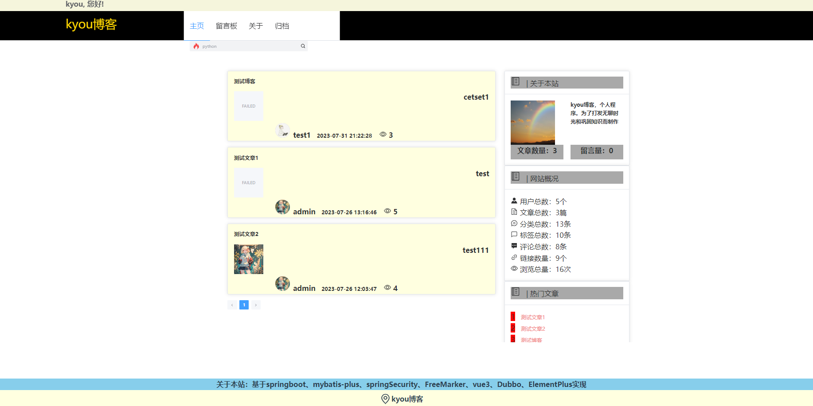

## 5.2–留言板

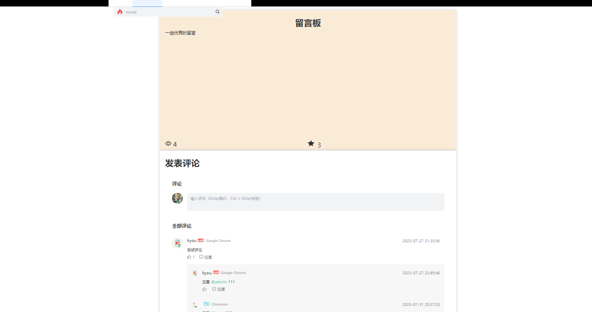

## 5.3–关于

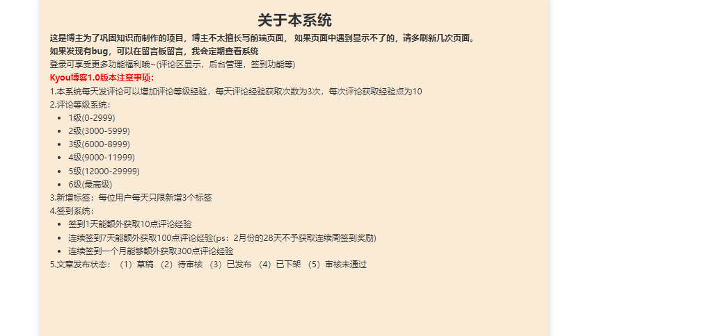

## 5.4-归档

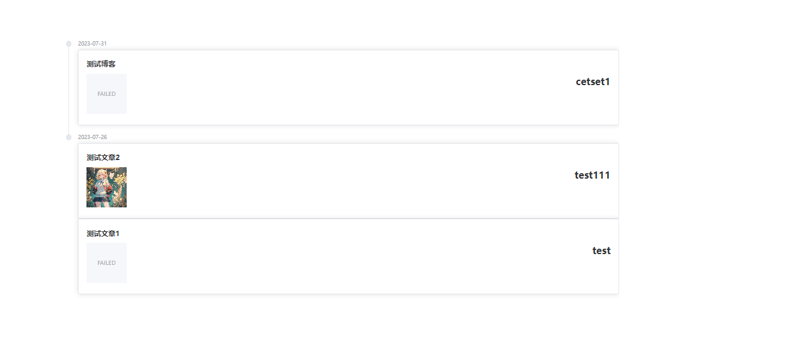

# 6.后台系统项目图片

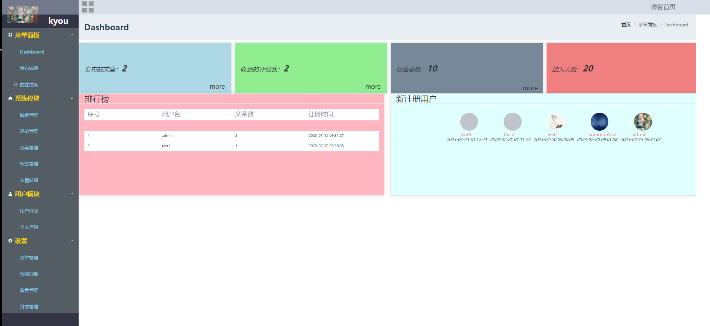

## 6.1–发布博客

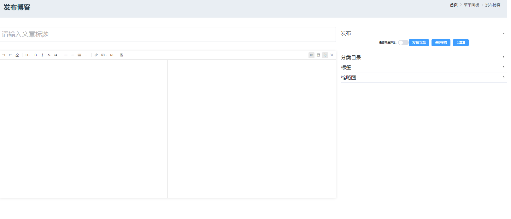

## 6.2–博客管理

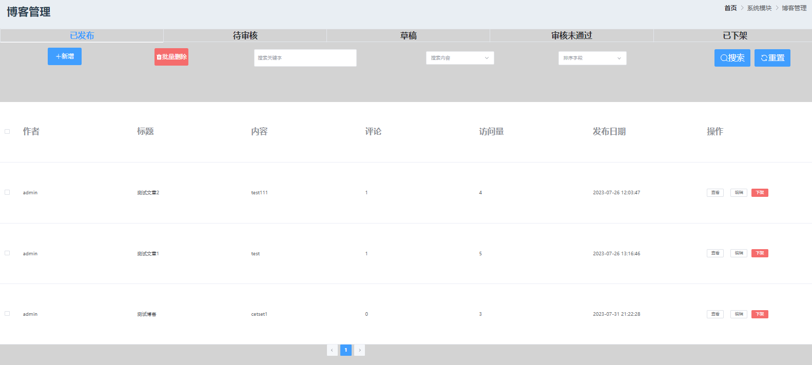

## 6.3–评论管理

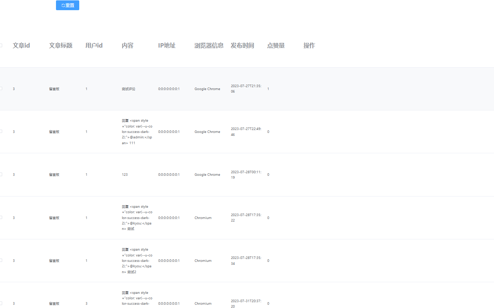

## 6.4-分类管理

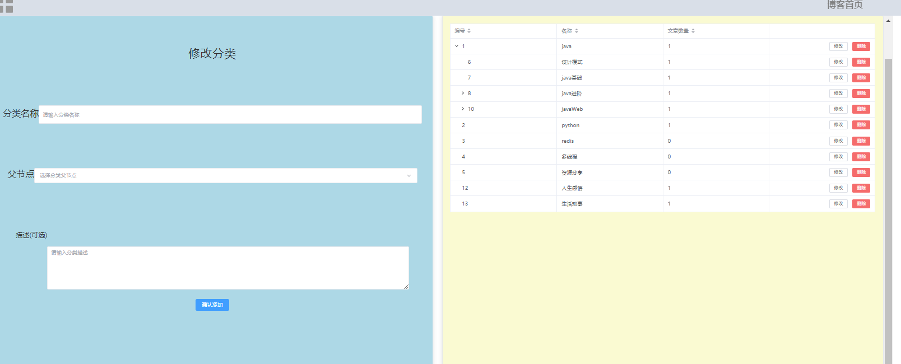

## 6.5-标签管理

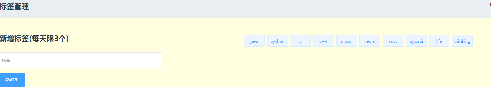

## 6.6-友情链接

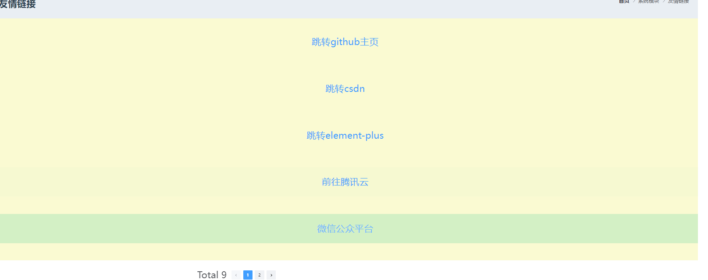

## 6.7-用户列表

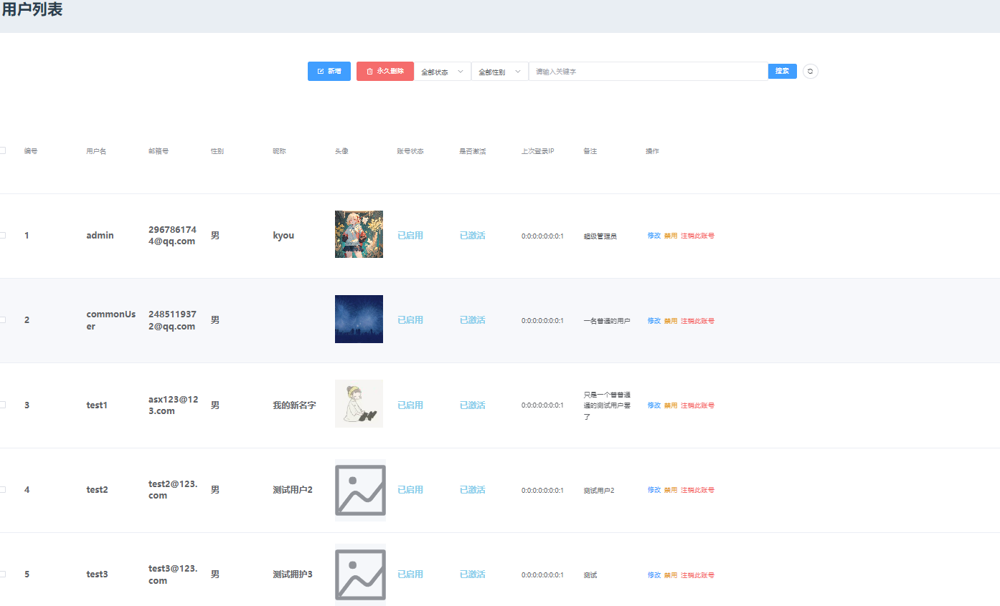

## 6.8-个人信息

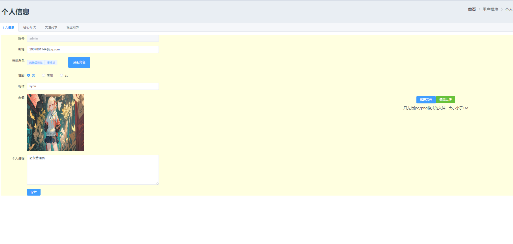

## 6.9-菜单管理

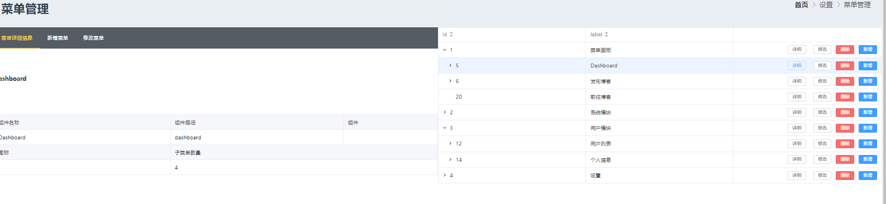

## 7.0-权限分配

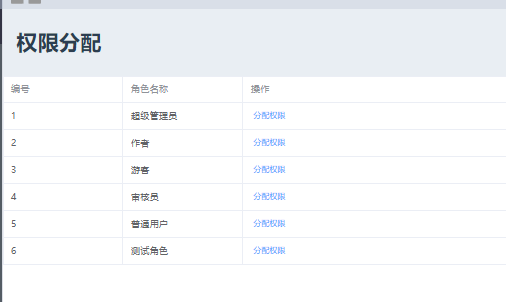

## 7.1-角色管理

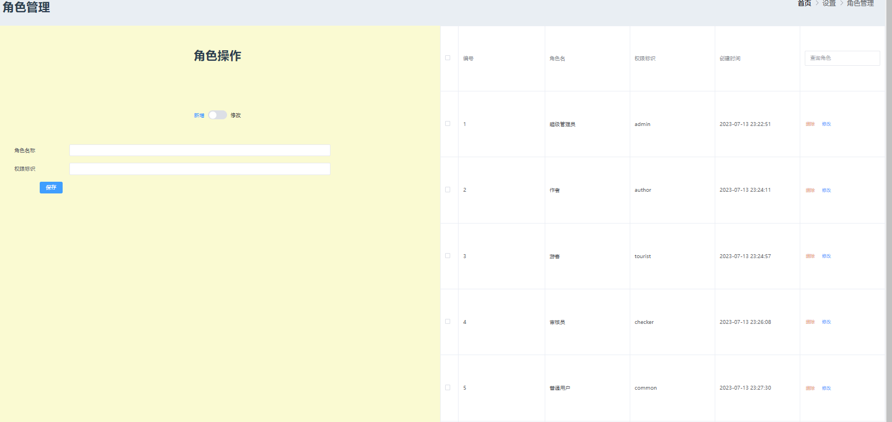

## 7.2-日志管理

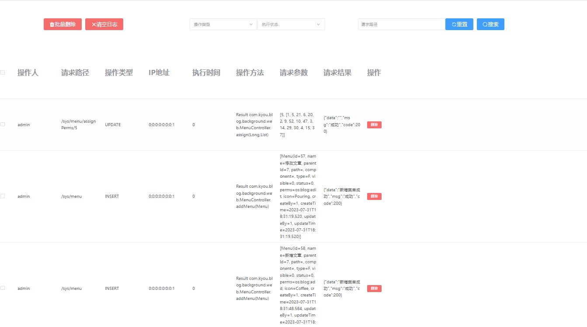